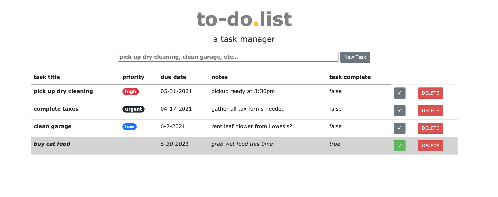
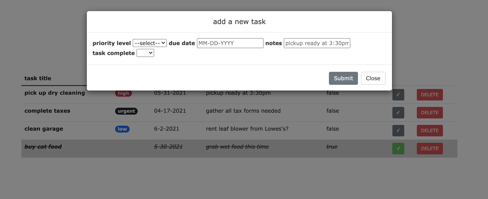

# SQL-TO-DO-LIST

## Description

_Duration: Weekend Sprint_

The goal of this project was to create a full-stack, CRUD, task manager application that allows the user to create tasks and check them off when complete. All tasks submitted are saved to a local database and then reflected on the client-side. As the database gets updated via the client (adding tasks, deleting tasks, completing tasks), these changes refresh for the user.

Additional features that I aimed for:
- Use labels for the priority of the task (urgent, high, medium, low) so that the user has a quick visual reference of their priorities within their To-Do List.

- Add a Modal, or separate window, to gather the details of each task upon creation. This cleaned up the main page and gave me a minimalist feel that I was going for.

- Create a check-mark visual to easily recognize when the task is marked complete.

To see the fully functional site, please visit: [DEPLOYED VERSION OF APP](www.heroku.com)

## Screen Shot

### Prerequisites

Link to software that is required to install the app (e.g. node).

- [Node.js](https://nodejs.org/en/)
- [PostgresSQL](https://www.postgresql.org/)
- [Homebrew](https://brew.sh/)

## Installation

How do you get your application up and running? This is a step by step list for how another developer could get this project up and running. The good target audience in terms of knowledge, would be a fellow Primer from another cohort being able to spin up this project. Note that you do not need a paragraph here to intro Installation. It should be step-by-step.

If your application has secret keys (for example --  Twilio), make sure you tell them how to set that up, both in getting the key and then what to call it in the `.env` file.

1. Create a database named `todo_list`,
2. The queries in the `database.sql` file are set up to create all the necessary tables and populate the needed data to allow the application to run correctly. The project is built on [Postgres](https://www.postgresql.org/download/), so you will need to make sure to have that installed. We recommend using [Postico](https://eggerapps.at/postico/) to run those queries as that was used to create the queries, 
3. Open up your editor of choice and run an `npm install`
4. Run `npm start` in your terminal to start the project's local server (http://localhost:5000/)
    - Stop the local server by pressing ctrl-c. for you!

## Built With

- Node.js
- PostgreSQL
- jQuery/Ajax
- Express
- Bootstrap

## Acknowledgement
Thanks to [Prime Digital Academy](www.primeacademy.io) who equipped and helped me to make this application a reality. 

Also thanks to my personal support system: Paran, Jonathon, Seth, Vino. 

## Support
If you have suggestions or issues, please email me at [dillon.j.baxendell@gmail.com](www.google.com)